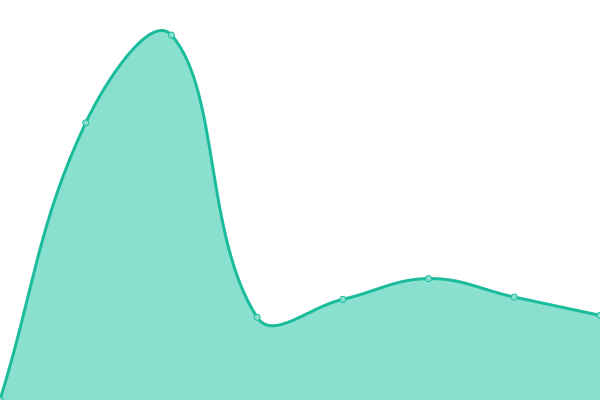
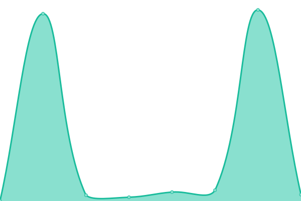
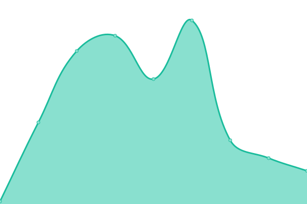
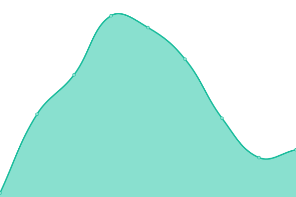

# [📈 Live Status](https://jacksonp2008.github.io/nayauptime): <!--live status--> **🟥 Complete outage**

This repository contains the open-source uptime monitor and status page for [Steven Pollock](https://jacksonp2008.github.io/nayauptime), powered by [Upptime](https://github.com/nayauptime/nayauptime).

With [Upptime](https://nayauptime.js.org), you can get your own unlimited and free uptime monitor and status page, powered entirely by a GitHub repository. We use [Issues](https://github.com/jacksonp2008/nayauptime/issues) as incident reports, [Actions](https://github.com/jacksonp2008/nayauptime/actions) as uptime monitors, and [Pages](https://jacksonp2008.github.io/nayauptime) for the status page.

<!--start: status pages-->
<!-- This summary is generated by Upptime (https://github.com/upptime/upptime) -->
<!-- Do not edit this manually, your changes will be overwritten -->
<!-- prettier-ignore -->
| URL | Status | History | Response Time | Uptime |
| --- | ------ | ------- | ------------- | ------ |
|  [Naya Pilates Main](https://nayapilates.com/) | 🟥 Down | [naya-pilates-main.yml](https://github.com/jacksonp2008/nayauptime/commits/HEAD/history/naya-pilates-main.yml) | 

 194ms
     
 | 

<a href="https://jacksonp2008.github.io/nayauptime/history/naya-pilates-main">0.00%</a>
    

|  [Naya Members](https://nayapilates.com/memberships/) | 🟥 Down | [naya-members.yml](https://github.com/jacksonp2008/nayauptime/commits/HEAD/history/naya-members.yml) | 

 21ms
     
 | 

<a href="https://jacksonp2008.github.io/nayauptime/history/naya-members">0.00%</a>
    

|  [Naya Courses](https://nayapilates.com/courses/) | 🟥 Down | [naya-courses.yml](https://github.com/jacksonp2008/nayauptime/commits/HEAD/history/naya-courses.yml) | 

 22ms
     
 | 

<a href="https://jacksonp2008.github.io/nayauptime/history/naya-courses">0.00%</a>
    

|  [Naya Coaching](https://nayapilates.com/coaching/) | 🟥 Down | [naya-coaching.yml](https://github.com/jacksonp2008/nayauptime/commits/HEAD/history/naya-coaching.yml) | 

 22ms
     
 | 

<a href="https://jacksonp2008.github.io/nayauptime/history/naya-coaching">0.00%</a>
    

|  [Naya Podcasts](https://nayapilates.com/podcasts/) | 🟥 Down | [naya-podcasts.yml](https://github.com/jacksonp2008/nayauptime/commits/HEAD/history/naya-podcasts.yml) | 

 22ms
     
 | 

<a href="https://jacksonp2008.github.io/nayauptime/history/naya-podcasts">0.00%</a>
    

|  [Bearclaw Finder](https://movewith.site/bearclaws/) | 🟥 Down | [bearclaw-finder.yml](https://github.com/jacksonp2008/nayauptime/commits/HEAD/history/bearclaw-finder.yml) | 

 147ms
     
 | 

<a href="https://jacksonp2008.github.io/nayauptime/history/bearclaw-finder">0.00%</a>
    

|  [Recipe Site](https://movewith.site/imhungry/) | 🟥 Down | [recipe-site.yml](https://github.com/jacksonp2008/nayauptime/commits/HEAD/history/recipe-site.yml) | 

 25ms
     
 | 

<a href="https://jacksonp2008.github.io/nayauptime/history/recipe-site">0.00%</a>
    

|  [Binford Estates](https://www.movewith.site/binford/) | 🟥 Down | [binford-estates.yml](https://github.com/jacksonp2008/nayauptime/commits/HEAD/history/binford-estates.yml) | 

 272ms
     
 | 

<a href="https://jacksonp2008.github.io/nayauptime/history/binford-estates">0.00%</a>
    

<!--end: status pages-->

[**Visit our status website →**](https://jacksonp2008.github.io/nayauptime)

## 📄 License

- Powered by: [Upptime](https://github.com/nayauptime/nayauptime)
- Code: [MIT](./LICENSE) © [Anand Chowdhary](https://anandchowdhary.com), supported by [Pabio](https://pabio.com)
- Data in the `./history` directory: [Open Database License](https://opendatacommons.org/licenses/odbl/1-0/)
